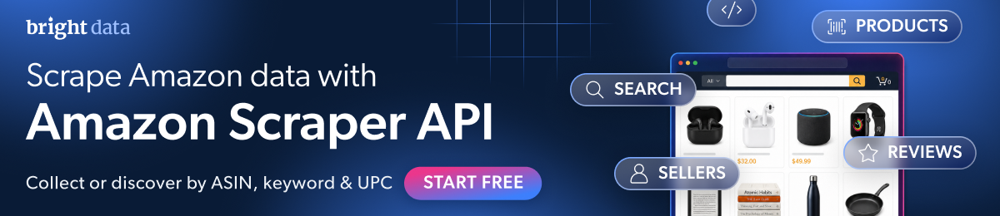

[](https://www.bright.cn/products/web-scraper/amazon?utm_source=github)

# amazon-scraper-python

[](https://github.com/bright-cn/amazon-scraper-python/actions/workflows/live.yml)
[](https://github.com/bright-cn/amazon-scraper-python/actions/workflows/live.yml) <!-- verified: rewritten by the daily run -->

[快速开始](#快速开始) · [命令行用法](#或作为命令运行) · [API 接口](#其他-api-接口) · [数据](#数据) · [错误处理](#出现错误时) · [编程智能体](#编程智能体) · [文档](https://docs.brightdata.com/products/scrapers/amazon/introduction) · [支持](#支持)

通过 Python 获取 JSON 格式的亚马逊商品、评论、卖家和搜索结果。无需登录，也无需浏览器。本项目基于
[Bright Data 亚马逊爬虫 API](https://www.bright.cn/products/web-scraper/amazon?utm_source=github)。

使用 [Bright Data Python SDK](https://github.com/bright-cn/sdk-python)。完整 API 文档：
[亚马逊爬虫 API](https://docs.brightdata.com/products/scrapers/amazon/introduction)。

本项目还提供用于抓取商品的一条命令，以及完全不需要 Python 的
[Bright Data CLI](#编程智能体)。

## 快速开始

需要 Python 3.10 或更高版本。

```bash
pip install brightdata-sdk
export BRIGHTDATA_API_TOKEN=YOUR_API_KEY
```

从 [Bright Data 控制面板](https://www.bright.cn/cp/setting/users)获取令牌。如果虚拟环境位于项目内，也可以将令牌放在项目根目录的 `.env` 文件中。

也可以不手动设置令牌：运行一次 `npx -p @brightdata/cli bdata login`。它会打开浏览器；此后，SDK 会自动找到已保存的凭据，供你以及在该终端中工作的任何编程智能体使用。智能体无法自行点击完成登录，因此请先亲自登录。

还没有账户？[创建账户](https://www.bright.cn/cp/start)。新账户每月可获得 [5,000 个免费积分](https://docs.brightdata.com/general/account/billing-and-pricing/free-tier)。

```python
from brightdata import SyncBrightDataClient

with SyncBrightDataClient(auto_create_zones=False) as client:
    product = client.scrape.amazon.products("https://www.amazon.com/dp/B0CRMZHDG8").data
    print(product["title"])
    print(product["final_price"], product["currency"], "|", product["rating"], "stars |",
          product["reviews_count"], "reviews")
```

```
STANLEY Quencher H2.0 Flow State Tumbler, 40 oz, Fuchsia
39.95 USD | 4.7 stars | 205036 reviews
```

每件商品消耗一个[积分](https://www.bright.cn/pricing/web-scraper)；API 给出的每条输入预计处理时间约为 7 秒。

每次都要传入 `auto_create_zones=False`。如果保持默认开启，SDK 会在启动时为网络解锁器和搜索引擎 API 创建区域。这是本爬虫工具完全不会用到的另外两款 Bright Data 产品；对于未添加支付方式的账户，创建区域会失败（[sdk-python#57](https://github.com/bright-cn/sdk-python/issues/57)）。

`products` 接收 URL，而不是 ASIN。因此，请像上面那样将 ASIN 写成 `/dp/` URL。

## 或作为命令运行

此仓库中的命令可以一次处理多个 ASIN，并将结果写入一个 JSON 文件。

```bash
pip install git+https://github.com/bright-cn/amazon-scraper-python
amazon-scraper B0CRMZHDG8 B085DVHQ57
```

```
Fetching 2 Amazon products: B0CRMZHDG8, B085DVHQ57
One job for all of them. One credit per product.
asking  2 products...

got     B0CRMZHDG8: 100 fields (STANLEY Quencher H2.0 Flow State Tumbler, 40 oz,)
got     B085DVHQ57: 99 fields (Owala FreeSip Stainless Steel Water Bottle 32 oz)

Saved 2 of 2 products as JSON to amazon.json
```

除了 ASIN，也可以直接传入商品 URL。同一个 ASIN 即使传入两次，也只会抓取一次，因此重复项不会产生额外费用。

在终端中，`asking` 行会被以下内容替代并原地更新，让你看到任务仍在运行以及已经运行了多久：

```
⠹ 2 products 0:00:14
```

```
--out PATH   输出文件，默认为 amazon.json
```

也可以运行 `python -m amazon_scraper`。

请求的所有 ASIN 都会放进同一个任务。API 按记录而非按任务计费，因此处理十件商品与处理一件商品只需等待同一轮任务。

也可以导入该函数，而不作为命令运行。这样每个 ASIN 都会得到 `ok` 和 `error` 状态，而不是原始数据行。单个 ASIN 出错时，`scrape` 不会抛出异常；读取 `product` 前请先检查 `ok`：

```python
from amazon_scraper import scrape

for outcome in scrape(["B0CRMZHDG8", "B0ZZZZZZZZ"]):
    if outcome.ok:
        print(f"{outcome.asin}: {outcome.product['title']}")
    else:
        print(f"{outcome.asin} failed: {outcome.error}")
```

```
B0CRMZHDG8: STANLEY Quencher H2.0 Flow State Tumbler, 40 oz, Fuchsia
B0ZZZZZZZZ failed: The navigation resulted in a dead page (404 status code)
```

## 其他 API 接口

上面的命令对应下表第一行。这里的每段示例代码都可以独立运行，只需安装 `brightdata-sdk`，直接复制即可。所有示例每周一都会在 Actions 中运行；其余日期还会运行较小规模的检查。页面顶部的徽章显示最新结果。

| 已有数据 | 所需结果 | 调用方式 |
| --- | --- | --- |
| 商品 URL | 该商品的数据 | `client.scrape.amazon.products(url)` |
| 关键词 | 一页搜索结果 | `client.search.amazon.products(keyword=...)`；见下文说明 |
| 卖家 URL | 该卖家的数据 | `client.scrape.amazon.sellers(url)` |
| 商品 URL | 该商品的评论 | `client.scrape.amazon.reviews(url)`；每条评论消耗一个积分，另见下文 |
| 关键词、分类 URL、畅销商品 URL 或 UPC | 完整商品记录 | 无对应的 Python 接口；见下文 |

Amazon 接口的 `timeout` 参数以秒为单位，默认值为 240。

### 此处不运行评论抓取，原因是费用

每条评论消耗一个积分。`reviews()` 虽然接收 `numOfReviews`、`pastDays` 和 `keyWord` 参数，却不会发送其中任何一个：请求仅根据 URL 构建（[sdk-python#62](https://github.com/bright-cn/sdk-python/issues/62)）。因此，`reviews(url, numOfReviews=20)` 实际上会请求所有评论，而且不会给出警告。

API 支持通过 `max_reviews` 限制数量，Bright Data 官方文档中的示例也将其设为 20。但 SDK 不会将 `numOfReviews` 映射到该参数。

快速开始部分的商品显示有 205,036 条评论，而这只需一次调用就可能全部请求。在 SDK 能够发送数量上限之前，如需获取有界数量的评论，请直接调用 REST 接口。

### 关键词搜索：它与完整商品发现有何区别

`client.search.amazon.products(keyword=...)` 返回商品搜索数据集中的数据行，每条搜索结果对应一行，每行约有 30 个字段。它不同于 Node 版本的关键词商品发现功能；后者返回包含全部 119 个字段的商品记录。

该接口没有限制返回行数的参数，也不会发送 `pages_to_search`。这里不运行它，因为本 README 中的所有示例都会每周重新运行。

API 还可以通过关键词、分类 URL、畅销商品 URL 和 UPC 发现完整商品记录。Python SDK 不提供这四种方式；JavaScript SDK 则全部支持。

### 多件商品，一个任务

传入 URL 列表只会创建一个任务，而不是每件商品创建一个任务。

```python
from brightdata import SyncBrightDataClient

with SyncBrightDataClient(auto_create_zones=False) as client:
    results = client.scrape.amazon.products([
        "https://www.amazon.com/dp/B0CRMZHDG8",
        "https://www.amazon.com/dp/B085DVHQ57",
    ])
    for result in results:
        row = result.data
        print(row["asin"], "|", row["brand"], "|", row["final_price"], row["currency"])
```

```
B0CRMZHDG8 | STANLEY | 39.95 USD
B085DVHQ57 | Owala | 29.99 USD
```

请像上面那样，通过数据行自身的 `asin` 判断它属于哪件商品，绝不要依赖 `result.url`。SDK 按位置将结果与你传入的 URL 配对，而 API 每次返回数据行的顺序可能不同。因此，`result.url` 可能指向一件商品，`result.data` 却包含另一件商品。所有结果还都会被标记为 `success=True`，包括无效 ASIN 对应的错误行（[sdk-python#60](https://github.com/bright-cn/sdk-python/issues/60)）。

### 立即触发，稍后获取

如果要处理的商品不止几件，不要让进程阻塞等待一个小时。先触发任务，保存快照 ID，待任务完成后再获取结果。快照在 30 天内可下载。

```python
import time

from brightdata import SyncBrightDataClient

with SyncBrightDataClient(auto_create_zones=False) as client:
    job = client.scrape.amazon.products_trigger("https://www.amazon.com/dp/B0CRMZHDG8")
    print("snapshot:", job.snapshot_id)
    while (status := client.scrape.amazon.products_status(job.snapshot_id)) not in ("ready", "failed"):
        time.sleep(5)
    print("status:", status)
    record = client.scrape.amazon.products_fetch(job.snapshot_id)[0]
    print("fetched:", record["asin"], "|", record["title"][:40])
```

```
snapshot: sd_muars9x1e0ejmq4cx
status: ready
fetched: B0CRMZHDG8 | STANLEY Quencher H2.0 Flow State Tumbler
```

## 数据

大多数人需要的商品字段：

```
asin  title  brand  final_price  currency  rating  reviews_count  availability
```

代码中没有写死字段列表。API 返回的所有字段都会进入 `result.data`，也会写入命令生成的文件。

API 在模式中以 `pii: true` 将其中 3 个字段标记为个人数据：`seller_name`、`zipcode` 和 `coupon`。`get_metadata()` 会丢弃该标记（[sdk-python#61](https://github.com/bright-cn/sdk-python/issues/61)），因此下表改为读取原始元数据接口。

<!-- fields:start -->
<details>
<summary>全部 119 个字段及其类型和说明</summary>

下表每天通过原始元数据接口，根据数据集模式重新生成，以避免内容过时。商品记录只包含适用于该商品的字段：示例文件包含这 119 个字段中的 97 个，另有模式中未列出的 `timestamp` 和 `input`。

| 字段 | 类型 | 说明 |
| --- | --- | --- |
| `title` | text | 商品标题 |
| `seller_name` | text | 个人数据。卖家名称 |
| `brand` | text | 商品品牌 |
| `description` | text | 商品简介 |
| `initial_price` | price | 初始价格 |
| `currency` | text | 商品价格的货币 |
| `availability` | text | 商品供货状态 |
| `reviews_count` | number | 评论数量 |
| `categories` | array | 商品分类 |
| `parent_asin` | text | 商品的父 ASIN |
| `asin` | text | 每件商品的唯一标识符 |
| `buybox_seller` | text | 购物车购买框中的卖家 |
| `number_of_sellers` | number | 该商品的卖家数量 |
| `root_bs_rank` | number | 商品在总分类中的畅销榜排名 |
| `ISBN10` | text | 图书的 ISBN-10 标识符 |
| `answered_questions` | number | 已回答的问题数量 |
| `domain` | url | 商品所属域名的 URL |
| `images_count` | number | 图片数量 |
| `url` | url | 直接指向商品的 URL |
| `video_count` | number | 视频数量 |
| `image_url` | url | 直接指向商品图片的 URL |
| `item_weight` | text | 商品重量 |
| `rating` | number | 商品评分 |
| `product_dimensions` | text | 商品尺寸 |
| `seller_id` | text | 每位卖家的唯一标识符 |
| `image` | url | 直接指向商品图片的 URL |
| `date_first_available` | text | 商品首次上架日期 |
| `discount` | text | 商品折扣信息 |
| `model_number` | text | 商品型号 |
| `manufacturer` | text | 商品制造商 |
| `department` | text | 商品所属部门 |
| `plus_content` | boolean | 是否存在附加内容 |
| `upc` | text | 通用产品代码 |
| `video` | boolean | 是否包含视频 |
| `top_review` | text | 商品的热门评论 |
| `final_price_high` | price | 最终价格为区间时的最高值 |
| `final_price` | price | 商品最终价格 |
| `variations` | array | 同一商品不同变体的详细信息 |
| `delivery` | array | 配送相关信息 |
| `features` | array | 商品特点 |
| `format` | array | 图书格式相关信息 |
| `buybox_prices` | object | 商品价格详情 |
| `input_asin` | text | 输入的 ASIN（目前未启用） |
| `ingredients` | text | 商品成分，主要适用于食品 |
| `origin_url` | url | 用于提取该记录的来源页面 URL |
| `bought_past_month` | number | 过去一个月的购买数量（以亚马逊显示的数据为准） |
| `is_available` | boolean | 商品是否仍有货 |
| `root_bs_category` | text | 畅销商品的根分类 |
| `bs_category` | text | 畅销商品分类 |
| `bs_rank` | number | 商品在特定分类中的畅销榜排名 |
| `badge` | text | 商品徽章，例如“#1 Best Seller”或“Amazon's Choice” |
| `subcategory_rank` | array | 各子分类中的畅销榜排名条目 |
| `amazon_choice` | boolean | 商品是否被标记为 Amazon's Choice |
| `images` | array | 商品图片的 URL |
| `product_details` | array | 完整商品详情 |
| `prices_breakdown` | object | 标价、常规价格及优惠状态的明细 |
| `country_of_origin` | text | 商品原产国 |
| `from_the_brand` | array | 页面上显示的品牌宣传媒体内容 |
| `product_description` | array | 商品描述部分嵌入的媒体内容 |
| `seller_url` | url | 卖家在亚马逊上的店铺或个人主页 URL |
| `customer_says` | text | 顾客评价摘要 |
| `sustainability_features` | array | 可持续发展徽章或认证及其参考信息 |
| `climate_pledge_friendly` | boolean | 商品是否显示 Climate Pledge Friendly 徽章 |
| `videos` | array | 商品视频的 URL |
| `other_sellers_prices` | array | 其他卖家对同一商品的报价 |
| `downloadable_videos` | array | 媒体文件的直接 URL |
| `editorial_reviews` | array | 图书的编辑评论 |
| `about_the_author` | text | 作者简介 |
| `zipcode` | text | 个人数据。用于估算配送和供货情况的邮政编码 |
| `coupon` | text | 个人数据。优惠券 |
| `sponsered` | boolean | 是否为赞助内容 |
| `store_url` | url | 商品所属店铺的 URL |
| `ships_from` | text | 商品发货地 |
| `city` | text | 与配送、卖家或地点相关的城市 |
| `customers_say` | object | 从评论中提取的亚马逊“顾客评价”摘要 |
| `max_quantity_available` | number | 允许加入购物车的最大数量 |
| `variations_values` | array | 商品变体及其可选值 |
| `language` | text | 商品页面或内容的语言 |
| `return_policy` | text | 商品页面上显示的退货政策文本 |
| `inactive_buy_box` | object | 购物车购买框不可用或未启用时的价格信息 |
| `buybox_seller_rating` | number | 购物车购买框中卖家的评分 |
| `premium_brand` | boolean | 是否为高端品牌 |
| `amazon_prime` | boolean | 是否支持 Amazon Prime 配送 |
| `coupon_description` | text | 优惠券说明 |
| `all_badges` | array | 所有徽章 |
| `sponsored` | boolean | 亚马逊赞助内容标记 |
| `variant_id` | text | 特定商品变体的唯一标识符 |
| `product_category` | text | 用分隔符连接的完整分类面包屑路径 |
| `category_tree` | array | 由名称和 URL 对象组成的分类层级 |
| `availability_date` | text | 缺货商品的预计供货日期 |
| `listing_has_variations` | boolean | 商品页面是否包含多个变体 |
| `variant_attributes` | array | 当前变体的属性，以名称和值配对表示 |
| `variants` | array | 按类型分组的结构化变体选项 |
| `seller_privacy_policy` | text | 卖家隐私政策的 URL |
| `seller_tos` | text | 卖家服务条款的 URL |
| `return_window` | number | 允许退货的天数 |
| `target_countries` | array | 商品可配送至的国家 |
| `store_country` | text | 店铺所在国家 |
| `category_urls` | array | 分类面包屑路径 |
| `all_variations` | boolean | 是否采集所有变体的输入字段 |
| `safety_information` | text | 安全信息 |
| `subcategory_link` | array | 各子分类的畅销榜链接条目 |
| `all_inactive_buy_box` | array | 所有未启用的购物车购买框信息 |
| `is_frequently_returned_item_badge` | boolean | 是否显示“经常退货的商品”徽章 |
| `frequently_returned_item_message` | text | 警告框中显示的文字 |
| `is_customers_usually_keep` | boolean | 顾客是否通常会保留该商品 |
| `title_badge` | text | 徽章标题 |
| `review_images` | array | 评论图片 |
| `review_videos` | array | 评论视频 |
| `also_viewed` | array | 顾客还浏览了 |
| `similar_items` | array | 可考虑的类似商品 |
| `bought_past_month_text` | text | 过去一个月的购买数量（以亚马逊显示的文本形式呈现） |
| `is_high_price` | boolean | 商品是否被标记为高价 |
| `title_highlight` | text | 亚马逊在商品页面上紧接商品标题显示的补充营销或强调文本 |
| `title_clean` | text | 卖家或品牌定义的实际商品标题，不包含页面上可能紧邻标题显示的亚马逊强调文本 |
| `customers_say_topics` | array | “顾客评价”部分的结构化主题明细 |
| `brand_url` | url | 商品品牌的 URL |
| `variant_condition` | text | 商品变体的成色或状态，例如全新、翻新或优质翻新 |
| `is_aplus_premium` | boolean | 商品是否使用高级 A+ 内容 |

</details>
<!-- fields:end -->

<details>
<summary>运行 <code>amazon-scraper B0CRMZHDG8</code> 后，真实输出文件的开头</summary>

```json
{
  "generated_at": "2026-09-21T04:54:18.105606+00:00",
  "products": [
    {
      "asin": "B0CRMZHDG8",
      "product": {
        "title": "STANLEY Quencher H2.0 Flow State Tumbler, 40 oz, Fuchsia",
        "seller_name": "Avrix Brands",
        "brand": "STANLEY",
        "description": "Constructed of recycled stainless steel for sustainable sipping, our 40 oz Quencher H2.0 offers maximum hydration with fewer refills. Commuting, studio workouts, day trips or your front porch\u2014you\u2019ll want this tumbler by your side. Thanks to Stanley\u2019s vacuum insulation, your water will stay ice-cold, hour after hour. The advanced FlowState\u2122 lid features a rotating cover with three positions: a straw opening designed to resist splashes while holding the reusable straw in place, a drink opening, and a full-cover top. The ergonomic handle includes comfort-grip inserts for easy carrying, and the narrow base fits just about any car cup holder.",
        "initial_price": 45,
        "currency": "USD",
        "availability": "In Stock",
        "reviews_count": 205036,
        "categories": [
          "Home & Kitchen",
          "Kitchen & Dining",
          "Storage & Organization",
          "Thermoses",
  ...
```

包含一件商品及其所有字段的完整文件见
[examples/sample_output.json](examples/sample_output.json)。

</details>

## 出现错误时

| 显示内容 | 含义 |
| --- | --- |
| `API token required but not found.` | 在发送任何请求前以退出码 2 退出。请设置令牌。 |
| `failed  ASIN: The navigation resulted in a dead page (404 status code)` | 以退出码 1 退出。该商品不存在，通常是 ASIN 输入有误。 |
| `failed  ASIN: the API returned no row for this ASIN` | 以退出码 1 退出。任务结果中没有该输入对应的数据行。请重新运行。 |
| `failed  ASIN: timeout` | 以退出码 1 退出。请求在 240 秒后超时。请重新运行。 |
| `failed  ASIN: Failed to fetch results: Request timeout after 30 seconds` | 以退出码 1 退出。任务已完成，但下载结果耗时超过 30 秒。请重新运行。 |

发生任何错误都会以退出码 1 退出，因此可以安全地根据命令的退出状态决定脚本是否继续执行。

在 SDK 中，相同情况会表现为：

| 显示内容 | 含义 |
| --- | --- |
| `AuthenticationError: Unauthorized (401)` | 已设置令牌，但令牌不正确。 |
| `result.success` 为 `False`，`result.status` 为 `"timeout"` | SDK 等待任务超时，默认等待 240 秒。调用时传入更大的 `timeout`，或重新运行。 |
| `Failed to fetch results: Request timeout after 30 seconds` | 任务已完成，但下载未完成。这是客户端对每个 HTTP 请求设置的超时限制，即 `SyncBrightDataClient(timeout=30)`，不是调用时传入的 `timeout`。增大调用时的 `timeout` 无济于事。 |
| `result.data` 中包含带有 `error` 键的字典 | 这是 API 对某条输入返回的结果。即使如此，`result.success` 仍会显示 `True`；请检查数据行。 |

## 编程智能体

无需 Python，也无需预先安装。复制并运行下面两行；第一行会打开浏览器完成一次登录。如果通过 SSH 或在 CI 中运行，也可以使用 `bdata login --device`：

```bash
npx -p @brightdata/cli bdata login
npx -p @brightdata/cli bdata pipelines amazon_product "https://www.amazon.com/dp/B0CRMZHDG8"
```

`bdata pipelines list` 会列出所有类型。亚马逊相关类型包括 `amazon_product`、`amazon_product_reviews` 和 `amazon_product_search`。它们都接收 URL、输出 JSON，并按每条记录一个积分计费。

`npx skills add brightdata/skills` 可以让 Claude Code、Cursor 和 Codex 学会这些命令及相关文档；之后就可以用自然语言提出需求。完整指南：
[面向编程智能体的 Bright Data 指南](https://docs.brightdata.com/quickstart-coding-agent)。

使用托管助手、没有终端？[Bright Data MCP 服务器](https://github.com/bright-cn/brightdata-mcp#which-tool-to-use)的 `ecommerce` 工具组提供亚马逊工具，但默认不会启用，必须明确指定：

    https://mcp.brightdata.com/mcp?token=YOUR_API_TOKEN&groups=ecommerce

智能体还可以自行创建账户，无需填写注册表单：
[智能体注册](https://www.bright.cn/auth.md)。从 LangChain 到 Zapier 和 n8n，Bright Data 支持的其他连接方式见：
[集成](https://docs.brightdata.com/integrations/introduction)。

## 支持

如发现此仓库中的问题，请[提交 issue](https://github.com/bright-cn/amazon-scraper-python/issues)；提交时应提供的信息见 [CONTRIBUTING.md](CONTRIBUTING.md)。

如有 API、账户或积分相关问题，请联系 [Bright Data 支持团队](https://brightdata.zendesk.com/hc/en-us/requests/new)。

## 许可证

MIT。
